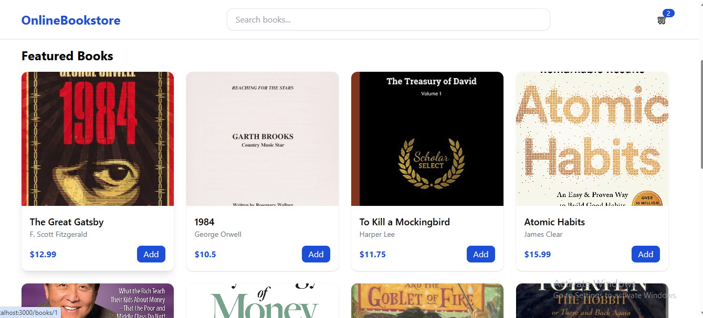
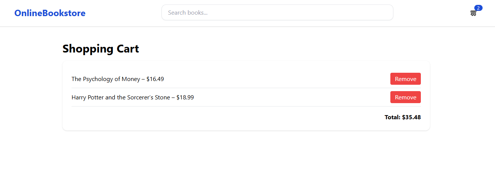
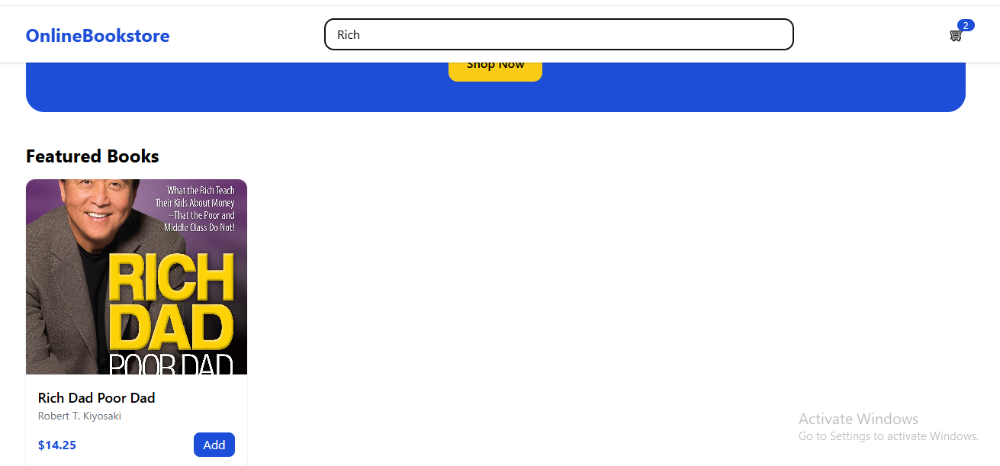

## Project Description
The Online Bookstore is a React-based web application that allows users to browse, search, and purchase books. Users can add books to their shopping cart, view book details, and manage their cart seamlessly. This project demonstrates a fully functional e-commerce experience for digital books.

**Key Features:**
- Browse and search books by title or author.
- View detailed information for each book.
- Add and remove books from the shopping cart.
- Real-time cart count displayed in the navbar.
- Responsive UI design.

**Screenshot:**

